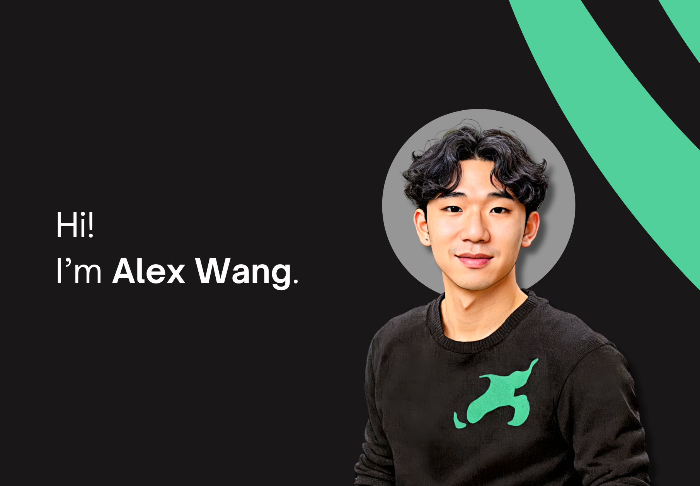

  current SWE @SpaceX 🚀  
  working on self-driving cars, ai, and an open-source TARS from my favourite childhood movie Interstellar.

  come check us out: <a href="https://github.com/TARS-AI-Community/TARS-AI">TARS-AI 🤖</a>

  join our community:     <a href="https://discord.gg/uXkqkz3mJJ">Discord Link</a>

--- 

  
  </img>
  </img>

<picture>
  <source media="(prefers-color-scheme: dark)" srcset="https://raw.githubusercontent.com/alexander-wang03/alexander-wang03/output/github-contribution-grid-snake-dark.svg">
  <source media="(prefers-color-scheme: light)" srcset="https://raw.githubusercontent.com/alexander-wang03/alexander-wang03/output/github-contribution-grid-snake.svg">
  
</picture>

